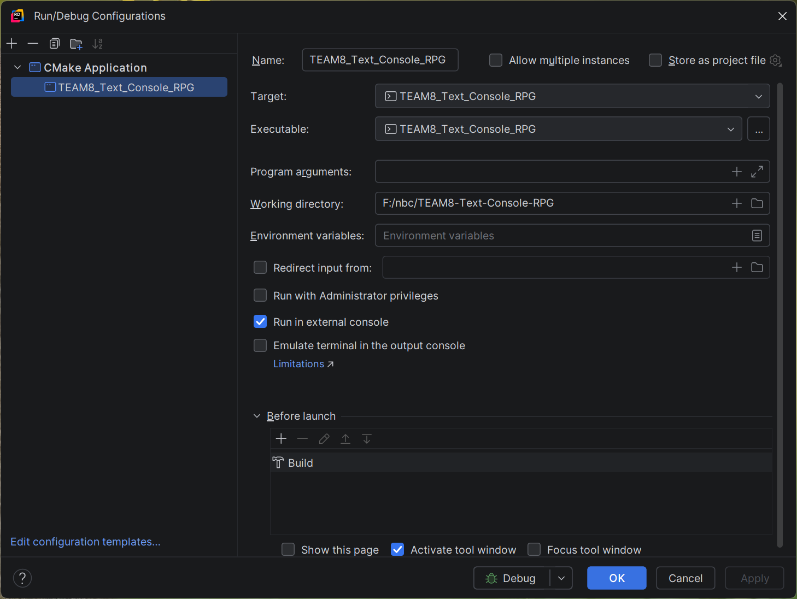
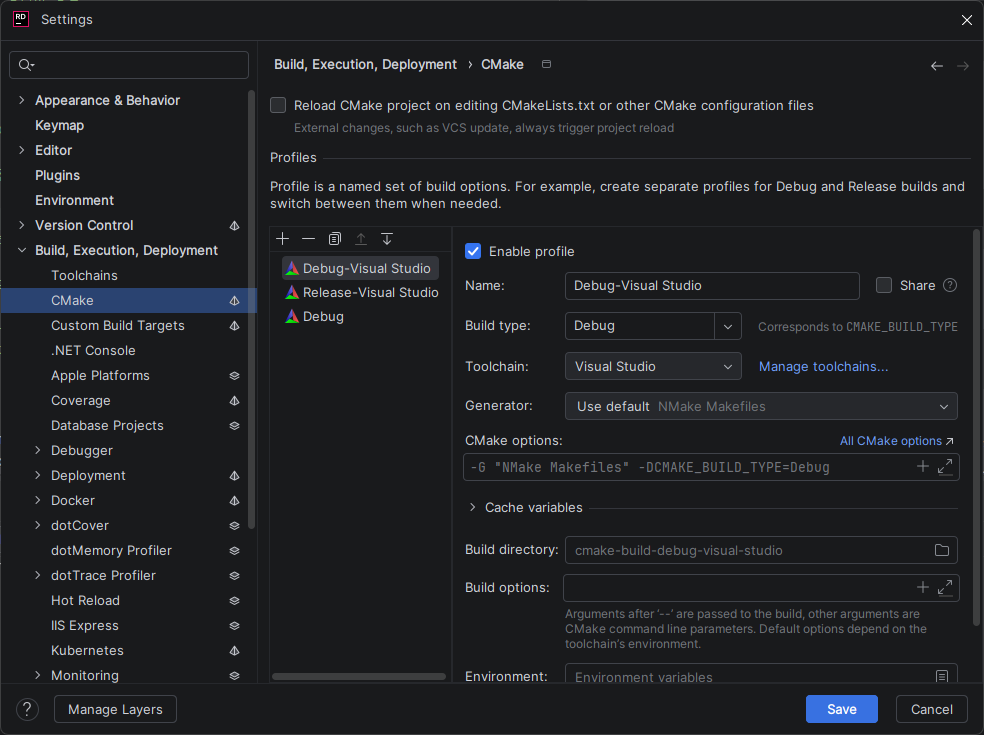

# TEXT CONSOLE RPG

### **소개**
- Auto Battler Text RPG
- 어떻게 하면 플레이어가 TEXT RPG 감성을 조금이라도 느낄수있을까 에 초점을 맞춤

### **주요 특징**
- 한 화면에서 창을 분할해서, 다양한 정보를 한눈에 볼수있도록 설정
- GameManager를 중심으로 각 시스템들(Item, Inventory, Character, Monster, UI, Shop, Sound)이 유기적으로 돌아갈수있도록 구현

### **주요 게임 사례 및 시연 영상**

### **게임 개발 과정**
- 노션의 다이어그램 예시대로 파트를 나눔
- 그러다 GameLog 및 UI 필요하다 판단되어 UIManager를 설정
- GameManager에서 전투를 담당하는 BattleManager를 따로 빼서 관리

### **트러블 슈팅**
- 매번마다 파일 추가하면 .vcxproj 충돌 → CMakelists.txt 바꿈
- Branch Rules
  - 한명이 독단적으로 pull request & merge로 날려버리는 위험성을 방지하기위해서 2명이상의 승인이 필요하도록 설정
- git convention
  - branch 이름을 대소문자구분해서 이름을 짓다가 branch 이름 충돌? 이 발생함
  - 그래서 대소문자 구분을 하지않고 이름을 짓기로 결정

### 환경 설정
- Rider
  - Working In Directory를 F:/nbc/TEAM8-Text-Console-RPG 로 설정
  - Run in external console 체크
    
  - CMake에서 Toolchain VisualStudio로 설정
    

### 🎵 Audio Assets & Credits
This project uses free audio assets from the incredible creators on itch.io.
Big thanks to the following creators:

* **Minifantasy - Dungeon Audio Pack** by [Leohpaz](https://leohpaz.itch.io/minifantasy-dungeon-sfx-pack)
* **400 Sounds Pack** by [Chequered Ink](https://ci.itch.io/400-sounds-pack)

> **Note:** The audio files included in the `Assets/Sound/` directory are for game execution purposes only. Do not redistribute or resell these unaltered audio assets. Support the original creators!

